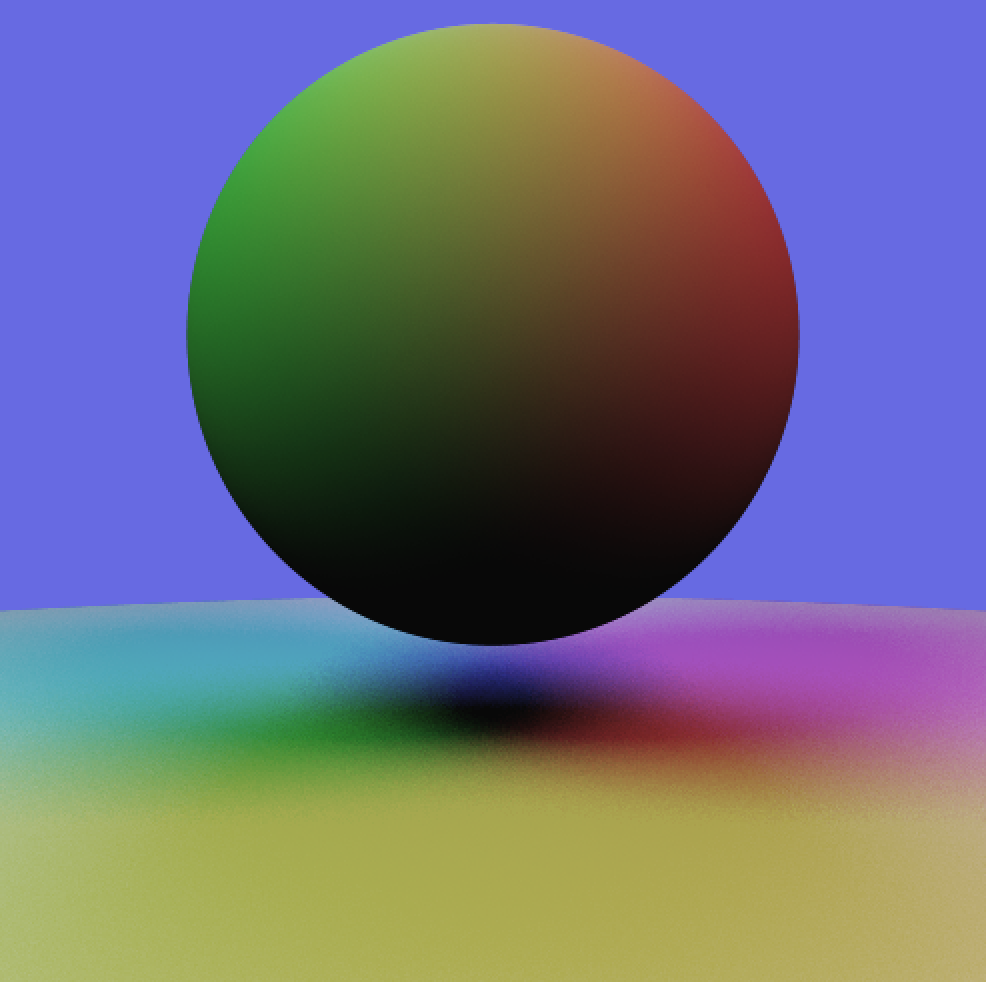
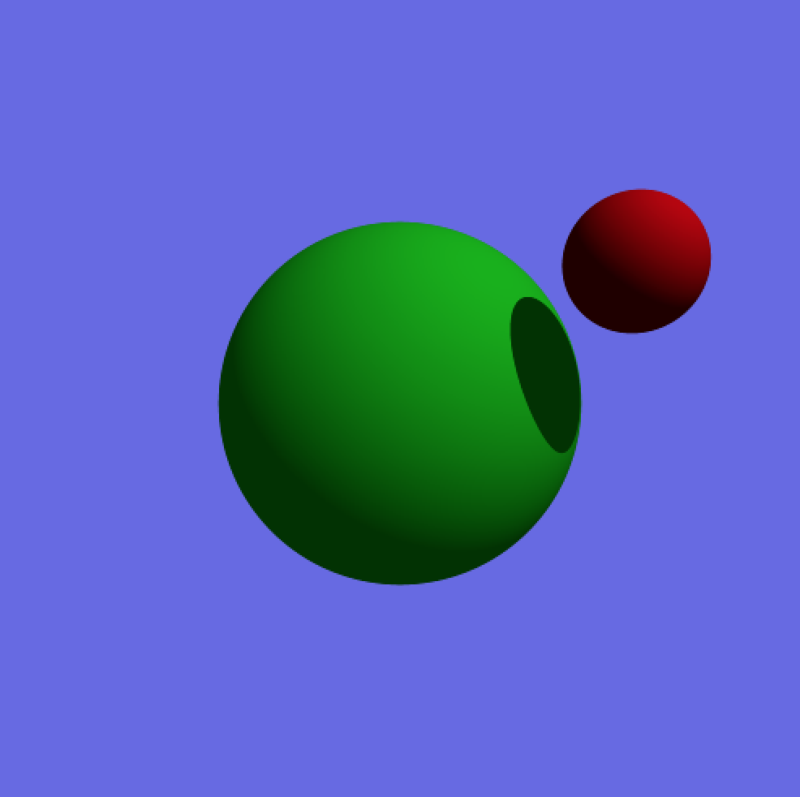

# p5.js Ray Tracer

This is my Ray Tracer project for CS 3451 Computer Graphics at Georgia Tech. 

This project implements ray tracing implementations for spheres and disks, and adds functionality for diffuse lighting, soft shadows, point lights, area lights, anti aliased sub sampling, and jitter shadow math.

Math is done by hand, no p5.js rendering is used. p5.js is merely used as the pixel screen. I also use p5.js vectors and a few other features to make life easier.

